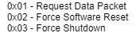

# mic-controller

## Purpose

This repository stores the source code for our microcontroller, an [STM32F091RCT6](https://www.mouser.com/ProductDetail/STMicroelectronics/STM32F091RCT6?qs=ClYTdQWm4hDCc82GnPpqOQ%3D%3D). The microcontroller is responsible for detecting bounces,
using under-the-table piezoelectric sensors, or contact microphones (hence the name, mic-controller). Similarly, it can accept user input
into a 4x4 keypad matrix to modify the gamemode, max score, and other options.

As an aside, the game logic, camera logic, and projector logic is handled by the laptop. For the laptop to know the current state
of the game and what to display, the microcontroller is necessary.

## Block Diagram

Our microcontroller sends all of the collected data through the microphones and the keypad to the laptop via [UART](https://www.analog.com/en/analog-dialogue/articles/uart-a-hardware-communication-protocol.html). These changes are then
processed by the laptop to control the game. The block diagram is shown below.

The information transmitted between the laptop and microcontroller through UART is shown in the packet structure, below. In practice, the
microcontroller will respond with its current packet data to the laptop upon reception of a REQUEST_PACKET message.

## Major functionalities

### Main

The main function calls setup functions to each of the used peripherals, defines a hardcoded threshold for the ADC bounce logic (explained
later), and enters an infinite loop. The microcontroller is event-driven, doing nothing until an interrupt is called. For ease of reference,
each of the interrupts are defined below:

### Interrupts

TIM17: A 1 kHz timer that helps check for button presses on the keypad matrix. TODO: add keypad pic
       It updates a history buffer for software debouncing, then sets a
       row high.
       
EXTI4_15: Called upon button press (more explicitly, this is called when one
          of the pins that is wired to a button output goes "high"). Based on
          the row set in TIM17, it determines which button has been pressed.
          It uses the history buffer to ignore [button bouncing](https://www.allaboutcircuits.com/technical-articles/switch-bounce-how-to-deal-with-it/).
          If a button has been determined to be pressed, the global packet information is updated.
         
TIM6_DAC: A 20 kHz timer that reads [ADC](https://en.wikipedia.org/wiki/Analog-to-digital_converter) conversions from the microphones to TODO: add mic pic
          interpret bounces. If the ADC data is greater than the threshold
          set in main, we accumulate the next 50 conversions from each of the
          four microphones (with 2 microphones on each side of the table).
          Then, the sides are summed separately; that with the greater sum
          is determined to have detected a bounce, and the global packet
          is updated accordingly.
          
USART3_4_5_6_7_8: Called upon reception of data from the laptop on the UART5
                  peripheral. If a request to send data back is received, the
                  global packet information is sent back, then cleared. If a
                  request to restart the microcontroller is sent, it is done so.
                  Otherwise, all other packets are ignored.
                  
